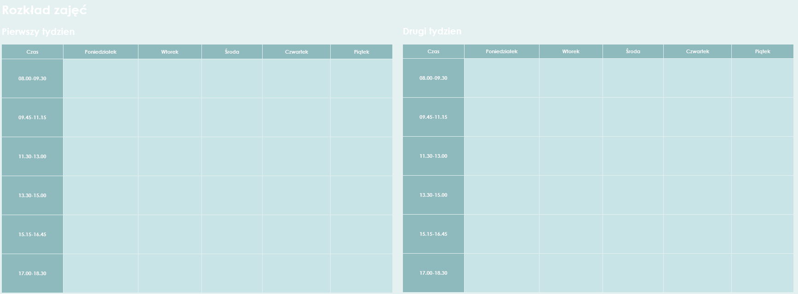

# Timetable_XML

### Final project on the subject of "XML standards".
This is a blank spreadsheet for recording your two-week schedule. You can write down the name of the course, the name of the lecturer and the number of the room in which the classes are held.

### Screenshot

